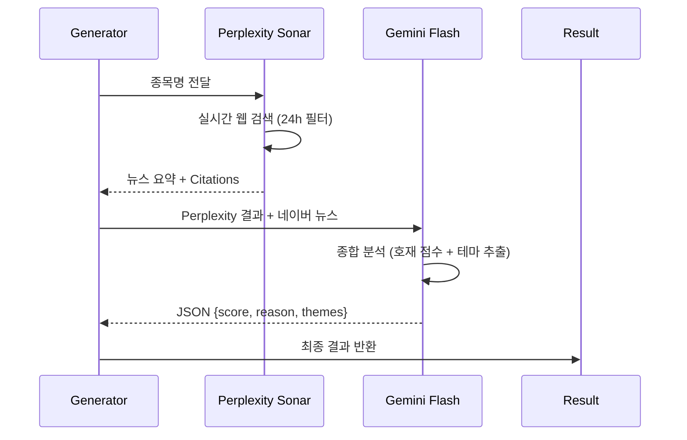

# 🤖 LLM 뉴스 분석 시스템 (Perplexity + Gemini)

> **소스 파일**: `kr_market/engine/llm_analyzer.py`  
> **최종 업데이트**: 2026-01-23  
> **버전**: v2.0

---

## 📊 분석 파이프라인 Overview



---

## 🔷 1. Perplexity Client (실시간 웹 검색)

### 클래스 정보

| 항목 | 값 |
|------|-----|
| **클래스명** | `PerplexityClient` |
| **API URL** | `https://api.perplexity.ai/chat/completions` |
| **모델** | `sonar` (실시간 웹 검색 특화) |
| **환경변수** | `PERPLEXITY_API_KEY` |

### 핵심 메서드: `search_stock_news()`

```python
async def search_stock_news(self, stock_name: str, stock_code: str = "") -> Dict:
    """
    Returns:
        {
            "news_summary": "뉴스 요약 텍스트",
            "citations": ["https://...", ...],  # 출처 URL 리스트
            "raw_response": "..."
        }
    """
```

### API 요청 구성

```python
payload = {
    "model": "sonar",                      # 실시간 검색 모델
    "messages": [
        {"role": "system", "content": "한국 주식 시장 전문 리서치 애널리스트..."},
        {"role": "user", "content": query}
    ],
    "temperature": 0.2,                    # 낮은 창의성 (사실 기반)
    "max_tokens": 1024,
    "return_citations": True,              # 출처 URL 반환
    "search_recency_filter": "day"         # 최근 24시간 결과 우선
}
```

### 검색 쿼리 템플릿

```
"{종목명}" 종목에 대한 최신 뉴스와 시장 동향을 검색해주세요.

다음 정보를 포함해서 답변해주세요:
1. 최근 24시간 이내의 주요 뉴스 (호재/악재)
2. 실적 관련 정보 (있는 경우)
3. 수주/계약 관련 정보 (있는 경우)
4. 관련 테마나 산업 동향
5. 기관/외국인 수급 동향 (있는 경우)
```

---

## 🔶 2. Gemini Analyzer (뉴스 분석 + 점수화)

### 클래스 정보

| 항목 | 값 |
|------|-----|
| **클래스명** | `GeminiAnalyzer` |
| **모델** | `gemini-3-pro-preview` (환경변수로 변경 가능) |
| **환경변수** | `GOOGLE_API_KEY`, `GEMINI_MODEL` |
| **타임아웃** | 30초 |

### 핵심 메서드: `analyze_news()`

```python
async def analyze_news(
    self, 
    stock_name: str, 
    news_content: str,           # Perplexity 결과
    traditional_news: List[Dict] = None  # 네이버 뉴스 (백업)
) -> Dict:
    """
    Returns:
        {"score": 2, "reason": "분석 이유", "themes": ["AI", "반도체"]}
    """
```

### 호재 점수 기준 (0~3점)

| 점수 | 조건 | 예시 |
|------|------|------|
| **3점** | 확실한 호재 | 대규모 수주, 어닝 서프라이즈, 신약 승인, M&A |
| **2점** | 긍정적 호재 | 실적 개선, 신사업 기대감, 테마 상승 모멘텀 |
| **1점** | 단순/중립 | 일반 뉴스, 큰 영향 없음 |
| **0점** | 악재 또는 무소식 | 부정적 뉴스, 호재 없음 |

### 테마 추출 예시

```
로봇, AI반도체, 2차전지, 방산, 우주항공, 바이오, 
그룹재편, M&A, HBM, 전력반도체, 태양광 ...
```

### 프롬프트 구조

```
당신은 주식 투자 전문가입니다. 다음은 '{종목명}' 종목에 대한 뉴스 및 정보입니다.

[Perplexity 실시간 검색 결과]
{news_content}

[네이버 금융 뉴스]
{traditional_text}

위 정보를 **종합적으로 분석**하여:
1. 현재 시점에서의 호재 강도를 0~3점으로 평가하세요.
2. 핵심 투자 테마를 추출하세요 (1~3개)

[출력 형식]
{"score": 2, "reason": "종합 평가 이유 한 줄", "themes": ["테마1", "테마2"]}
```

---

## 🔗 3. 통합 LLM Analyzer

### 클래스 정보

| 항목 | 값 |
|------|-----|
| **클래스명** | `LLMAnalyzer` |
| **역할** | Perplexity + Gemini 통합 오케스트레이터 |

### 핵심 메서드: `analyze_news_sentiment()`

```python
async def analyze_news_sentiment(
    self, 
    stock_name: str, 
    news_items: List[Dict]  # 네이버 뉴스 (백업용)
) -> Dict:
    """
    Returns:
        {
            "score": 2,              # 0~3 호재 점수
            "reason": "...",         # 분석 이유
            "themes": [...],         # 추출된 테마
            "citations": [...],      # Perplexity 출처 URL
            "source": "perplexity+gemini"
        }
    """
```

### 처리 흐름

```
1. Perplexity Sonar로 실시간 뉴스 검색
   ↓
2. Rate Limit 방지 (2초 대기)
   ↓
3. Gemini로 뉴스 분석 (Perplexity + 네이버 뉴스 통합)
   ↓
4. 결과 반환 {score, reason, themes, citations, source}
```

### Source 필드 값

| 값 | 의미 |
|----|------|
| `perplexity+gemini` | 정상 처리 (둘 다 사용) |
| `gemini_only` | Perplexity 결과 없음, Gemini만 사용 |
| `keyword_fallback` | Gemini 없음, 키워드 분석 폴백 |
| `none` | 분석 실패 |

---

## 🛡️ 4. 폴백 로직 (Fallback)

Gemini 없을 때 키워드 기반 분석 수행:

### 긍정 키워드 (+1점씩, 최대 3점)

```python
positive_keywords = [
    "흑자전환", "실적개선", "어닝서프라이즈", "사상최대", "호실적",
    "수주", "계약체결", "공급계약", "MOU", "신약", "임상성공",
    "FDA승인", "특허", "기술이전", "외국인매수", "기관매수"
]
```

### 부정 키워드 (즉시 0점)

```python
negative_keywords = [
    "횡령", "배임", "상장폐지", "관리종목", "적자전환", "적자확대",
    "검찰", "수사", "기소", "대량매도"
]
```

---

## ⚙️ 5. 환경 설정

### 필수 환경변수 (.env)

```bash
# Perplexity API (실시간 웹 검색)
PERPLEXITY_API_KEY=pplx-xxxxxxxxxxxxxxxx

# Google Gemini API (뉴스 분석)
GOOGLE_API_KEY=AIzaxxxxxxxxxxxxxxxx
GEMINI_MODEL=gemini-2.0-flash-exp  # Optional (기본값)
```

---

## 🧪 6. 테스트 실행

```python
# 단독 실행 테스트
python kr_market/engine/llm_analyzer.py
```

### 예상 출력

```json
{
  "score": 2,
  "reason": "HBM3E 양산 시작으로 AI 반도체 수요 대응 기대",
  "themes": ["HBM", "AI반도체"],
  "citations": ["https://news.example.com/..."],
  "source": "perplexity+gemini"
}
```

---

## 📈 7. 전체 스코어링에서의 위치

종가베팅 V2 총점 **12점** 중 **뉴스 분석 점수는 3점 (25%)**:

| 구성 요소 | 배점 |
|-----------|------|
| MA 정배열 | 2점 |
| 거래량 | 3점 |
| 캔들 패턴 | 2점 |
| 가격 위치 | 2점 |
| **뉴스 분석 (LLM)** | **3점** |
| 횡보 돌파 | +bonus |

---

> **참고**: 이 문서는 `kr_market/engine/llm_analyzer.py` 기반으로 작성되었습니다.
