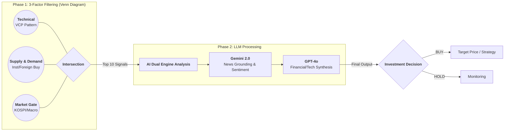

# 📊 KR Market 분석 프로세스 워크플로우

본 문서는 KR Market AI 주식 분석 시스템의 핵심 분석 메커니즘을 정의합니다. 시스템은 3가지 필터링 요소의 교집합을 찾고, AI Dual Engine을 통해 최종 의사결정을 내립니다.

## 2. 분석 단계별 로직 (Analysis Pipeline)

### [Phase 1] 교집합 필터링 (Venn Diagram)
1. **VCP (Volatility Contraction Pattern)**: 
   - 주가의 변동성이 점진적으로 줄어들며 에너지를 응축하는 기술적 패턴을 감지합니다.
   - 고점 대비 위치, 축소 비율(Contraction Ratio) 등을 수치화하여 점수를 산출합니다.
2. **Supply & Demand (수급 분석)**: 
   - 기관 및 외국인의 최근 5일, 20일, 60일 순매매 동향을 추적합니다.
   - 단순 매수량이 아닌, 매집 강도와 지속성을 평가합니다.
3. **Market Macro Gate (시장 상황)**:
   - KOSPI/KOSDAQ 지수의 추세와 RSI, MACD 지표를 분석합니다.
   - 환율 및 매크로 지표를 통해 시장이 '안전(GREEN)' 단계일 때만 공격적인 매수를 추천합니다.

### [Phase 2] AI Dual Engine 분석
- **Step 1 (Gemini 2.0)**: 구글 검색(Grounding)을 통해 해당 종목의 최신 뉴스, 공시, 실적 발표 내용을 실시간으로 파악하고 감성 분석을 수행합니다.
- **Step 2 (GPT-4o)**: VCP 데이터, 수급 점수, 재무제표, 그리고 Gemini가 요약한 뉴스 데이터를 통합하여 최종 투자 전략을 수립합니다.
- **Result**: 정성적 근거와 정량적 데이터를 결합한 최종 **BUY/HOLD** 의견과 신뢰도(Confidence)를 제공합니다.

---

> **Note**: 2026-01-03 업데이트  
> - `signal_tracker.py` 경로 버그 수정 (`os.path.dirname()` 제거)
> - `daily_prices.csv` 및 `all_institutional_trend_data.csv` 생성 로직 검증 완료

*Last Updated: 2026-01-04*
