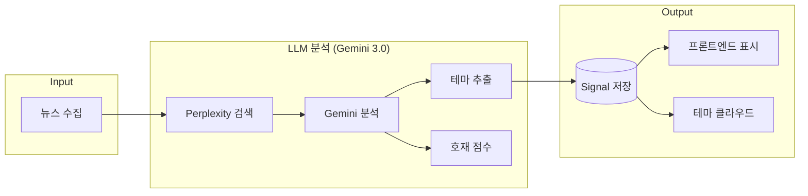

# 🏷️ 테마 추출 시스템 (Theme Extraction System)

> **소스 파일**: `kr_market/engine/llm_analyzer.py`, `generator.py`, `page.tsx`  
> **최종 업데이트**: 2026-01-23  
> **버전**: v2.0

---

## 📊 Overview

종가베팅 V2에서 **LLM 기반 테마 추출**은 주식 뉴스를 분석하여 해당 종목의 투자 테마를 자동으로 태깅하는 기능입니다.



---

## 🤖 1. 백엔드: LLM 프롬프트 설계

### 위치: `kr_market/engine/llm_analyzer.py`

### Gemini 프롬프트 (테마 추출 부분)

```python
prompt = f"""
당신은 주식 투자 전문가입니다. 다음은 '{종목명}' 종목에 대한 뉴스입니다.

{뉴스 내용}

위 정보를 분석하여:
1. 호재 강도를 0~3점으로 평가
2. 핵심 투자 테마를 추출 (1~3개)

[테마 예시]
로봇, AI반도체, 2차전지, 방산, 우주항공, 바이오, 
그룹재편, M&A, HBM, 전력반도체, 태양광 등

[출력 형식]
{{"score": 2, "reason": "평가 이유", "themes": ["테마1", "테마2"]}}
"""
```

### 반환 구조

```python
{
    "score": 2,              # 0~3 호재 점수
    "reason": "분석 요약",   # AI 분석 코멘트
    "themes": ["AI반도체", "HBM"],  # 추출된 테마 리스트
    "citations": [...],      # Perplexity 출처 URL
    "source": "perplexity+gemini"
}
```

---

## 📦 2. Signal 모델 확장

### 위치: `kr_market/engine/models.py`

```python
from dataclasses import dataclass, field
from typing import List

@dataclass
class Signal:
    stock_code: str
    stock_name: str
    grade: str
    score: ScoreDetail
    # ... 기존 필드들 ...
    
    themes: List[str] = field(default_factory=list)  # 🆕 테마 필드
    
    def to_dict(self):
        return {
            # ... 기존 필드들 ...
            "themes": self.themes,
        }
```

---

## ⚙️ 3. Generator 연결

### 위치: `kr_market/engine/generator.py` (Line 206)

```python
async def _analyze_stock(self, stock, target_date):
    # 1. 뉴스 수집
    news_list = await self._news.get_stock_news(stock.code, 3, stock.name)
    
    # 2. LLM 분석 (Perplexity + Gemini)
    llm_result = await self.llm_analyzer.analyze_news_sentiment(
        stock.name, 
        news_dicts
    )
    
    # 3. 시그널 생성 시 테마 포함
    signal = Signal(
        stock_code=stock.code,
        stock_name=stock.name,
        # ... 기존 필드들 ...
        themes=llm_result.get("themes", []) if llm_result else [],  # 🆕
    )
```

---

## 🎨 4. 프론트엔드 UI

### 위치: `frontend/src/app/dashboard/kr/closing-bet/page.tsx`

### 4.1 Signal 인터페이스

```typescript
interface Signal {
    stock_code: string;
    stock_name: string;
    grade: string;
    themes?: string[];  // 🆕 LLM 추출 테마
    // ...
}
```

### 4.2 개별 시그널 카드 - 테마 태그 표시

```tsx
{/* 테마 태그 표시 */}
{signal.themes && signal.themes.length > 0 && signal.themes.map((theme, i) => (
    <span 
        key={i} 
        className="px-2 py-1 rounded 
                   bg-violet-500/10 border border-violet-500/20 
                   text-violet-400 text-[10px]"
    >
        {theme}
    </span>
))}
```

### 4.3 Theme Cloud Widget (헤더 영역)

테마 빈도를 분석하여 워드 클라우드 형태로 표시:

```tsx
function ThemeCloudWidget({ signals }: { signals: Signal[] }) {
    // 1. 테마 빈도 집계
    const themeCounts: Record<string, number> = {};
    signals.forEach(s => {
        if (s.themes) {
            s.themes.forEach(t => {
                themeCounts[t] = (themeCounts[t] || 0) + 1;
            });
        }
    });

    // 2. 상위 15개 추출
    const sortedThemes = Object.entries(themeCounts)
        .sort((a, b) => b[1] - a[1])
        .slice(0, 15);

    // 3. 가중치 기반 크기 계산
    const maxCount = sortedThemes[0][1];
    const minCount = sortedThemes[sortedThemes.length - 1][1];

    return (
        <div className="flex flex-wrap gap-3">
            {sortedThemes.map(([theme, count]) => {
                const weight = (count - minCount) / (maxCount - minCount);
                
                // 가중치에 따른 폰트 크기
                let fontSize = 'text-xs';
                if (weight > 0.8) fontSize = 'text-2xl font-bold';
                else if (weight > 0.5) fontSize = 'text-lg font-bold';
                else if (weight > 0.3) fontSize = 'text-sm font-semibold';
                
                return (
                    <span 
                        key={theme} 
                        className={`${fontSize} bg-clip-text text-transparent 
                                    bg-gradient-to-r from-cyan-400 to-blue-500`}
                    >
                        {theme}
                    </span>
                );
            })}
        </div>
    );
}
```

### 4.4 디자인 스펙

| 요소 | 스타일 |
|------|--------|
| **개별 태그** | `bg-violet-500/10`, `text-violet-400`, 10px |
| **클라우드 배경** | Glassmorphism (`backdrop-blur-md`) |
| **호버 효과** | `scale-110`, `rotate-1` 트랜지션 |
| **그라데이션** | Cyber Blue, Neon Purple, Sunset 등 6종 |

---

## 📈 5. 데이터 흐름 전체도

```
┌─────────────────────────────────────────────────────────────┐
│                      종가베팅 V2 엔진                        │
├─────────────────────────────────────────────────────────────┤
│                                                             │
│  [1] Collector                                              │
│      └─→ 상승률 TOP 30 종목 추출                             │
│                                                             │
│  [2] News Collector                                         │
│      └─→ 네이버 금융 뉴스 크롤링                             │
│                                                             │
│  [3] LLM Analyzer                                           │
│      ├─→ Perplexity: 실시간 웹 검색 (24h)                   │
│      └─→ Gemini 3.0: 뉴스 분석 + 테마 추출                  │
│              │                                              │
│              ├─→ score: 0~3 (호재 점수)                     │
│              ├─→ reason: "AI 분석 요약"                     │
│              └─→ themes: ["AI반도체", "HBM"]  ← 🆕          │
│                                                             │
│  [4] Signal Generator                                       │
│      └─→ Signal 객체 생성 (themes 필드 포함)                │
│                                                             │
│  [5] JSON 저장                                              │
│      └─→ data/jongga_v2_latest.json                        │
│                                                             │
└─────────────────────────────────────────────────────────────┘
                            │
                            ▼
┌─────────────────────────────────────────────────────────────┐
│                      Flask API                              │
│                                                             │
│  GET /api/kr/jongga-v2/latest                              │
│      └─→ signals[].themes 포함하여 반환                     │
│                                                             │
└─────────────────────────────────────────────────────────────┘
                            │
                            ▼
┌─────────────────────────────────────────────────────────────┐
│                   Frontend (Next.js)                        │
│                                                             │
│  [1] ThemeCloudWidget (헤더)                               │
│      └─→ 테마 빈도 기반 워드 클라우드                        │
│                                                             │
│  [2] SignalCard (개별 카드)                                │
│      └─→ 테마 태그 (바이올렛 색상)                          │
│                                                             │
└─────────────────────────────────────────────────────────────┘
```

---

## 🏷️ 6. 테마 예시

| 종목 | 추출된 테마 |
|------|------------|
| 삼성전자 | HBM, AI반도체 |
| 한전기술 | 원전, 실적개선 |
| 뉴로메카 | 로봇, 협동로봇 |
| 포스코DX | SI, AI, 스마트팩토리 |
| 대한항공 | 항공, 어닝서프라이즈 |
| 에코프로 | 2차전지, 양극재 |
| 한화에어로스페이스 | 방산, 우주항공 |

### 자주 등장하는 테마 카테고리

| 카테고리 | 테마 예시 |
|----------|----------|
| **반도체** | AI반도체, HBM, 전력반도체, 파운드리 |
| **미래산업** | 로봇, 자율주행, 메타버스, 우주항공 |
| **에너지** | 2차전지, 태양광, 원전, SMR |
| **바이오** | 신약, 임상, FDA승인, 진단키트 |
| **이벤트** | M&A, 그룹재편, 실적개선, 어닝서프라이즈 |
| **정책** | 방산, 건설, 조선 |

---

## ⚠️ 7. 왜 LLM 기반을 선택했나?

| 방식 | 장점 | 단점 | 채택 |
|------|------|------|------|
| 네이버 테마 크롤링 | 공식 테마 | iframe 구조로 크롤링 어려움 | ❌ |
| 업종(Sector) 분류 | 안정적 | 동적인 테마 반영 불가 | ❌ |
| **LLM 뉴스 기반 추출** | 실시간, 동적, 정확 | API 비용 | ✅ |

> LLM이 이미 뉴스 분석(호재 점수)을 수행하고 있으므로, **추가 비용 없이** 테마도 함께 추출하는 것이 효율적.

---

## 📁 8. 변경 파일 목록

| 파일 | 변경 내용 |
|------|----------|
| `kr_market/engine/llm_analyzer.py` | 프롬프트에 테마 추출 가이드 추가 |
| `kr_market/engine/models.py` | Signal 클래스에 `themes` 필드 추가 |
| `kr_market/engine/generator.py` | LLM 결과에서 themes 추출하여 Signal에 연결 |
| `frontend/.../closing-bet/page.tsx` | 테마 태그 UI + ThemeCloudWidget |

---

## 🧪 9. 테스트 방법

### 9.1 단독 LLM 테스트

```bash
cd /Users/seoheun/Documents/국내주식
python -m kr_market.engine.llm_analyzer
```

### 9.2 전체 스크리너 실행

```bash
python -m kr_market.engine.generator
```

### 9.3 출력 확인

```bash
cat kr_market/data/jongga_v2_latest.json | jq '.signals[0].themes'
```

예상 출력:
```json
["AI반도체", "HBM"]
```

---

> **참고**: 이 문서는 `llm_analyzer.py`, `generator.py`, `page.tsx` 기반으로 작성되었습니다.
